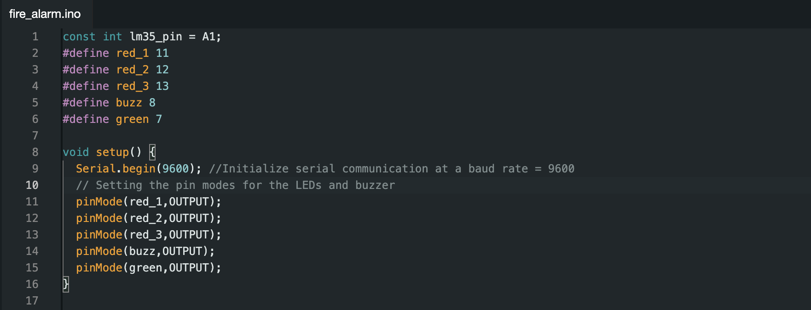
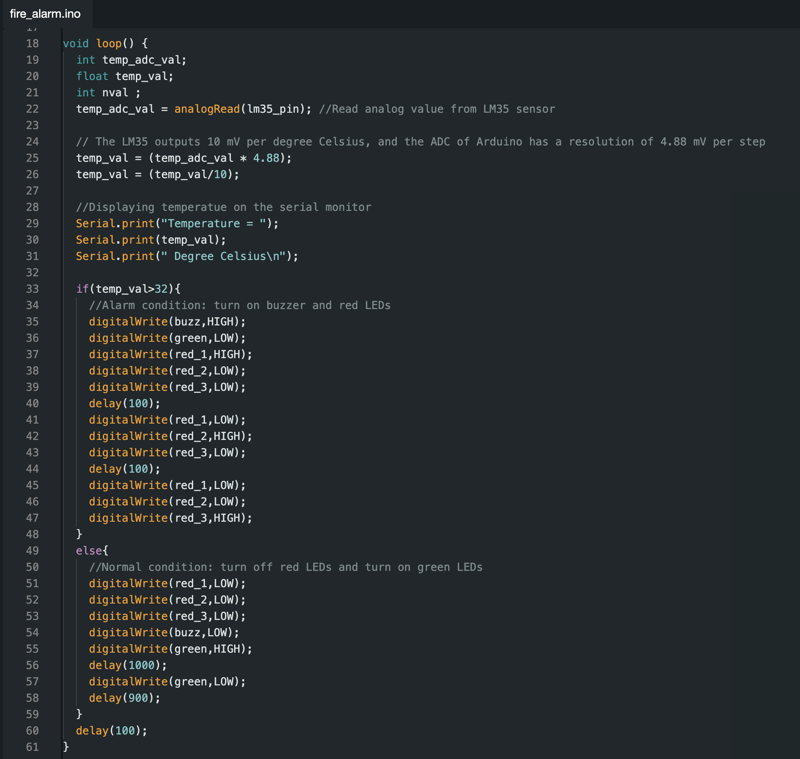

# Fire Alarm system
This is a basic fire alarm system built using an temperature sensor, LEDs, and a buzzer, all connected to an Arduino Uno. The system triggers an alarm when a high temperature is detected. Red lights glow and buzzer goes off. This is a beginner level project and my first attempt at embedded systems.

## Components used
1. Arduino Uno (datasheet: https://docs.arduino.cc/resources/datasheets/A000066-datasheet.pdf)
2. LM35 Temperature sensor (https://www.ti.com/product/LM35?bm-verify=AAQAAAAJ_____0y5WXqYJ_d89nDb9u-qzNbn2rlxeMd3u9HZJiAPQET6ULnGK7DJ5LPLYfdDus-TPjujBbXmVtOO2OVNHntXuVmh3cYE1WZDoQIDt1OWjTK8pinWTH6HhBrpuDg1b7mTvnfh_ndAeBok0VdpeFnuA4IBGIdDJ3hDfs2_yNVplbTBkrExH3K8qFx8HTFAzBGDS-Bv6vAQgjifcA0VsOduqmKaLdpSeFD0NPciSzOsxai9YT4DYig8thlNXHlM-vIsoPWBrdokf69MX4DW-XxwowOZy10_0UnpnPMvn-CREPg)
3. Red and Green LEDs
4. Buzzer
5. Breadboard
6. Jumper wires

## Arduino Code

The setup function runs once when the Arduino is powered on. It sets up the initial state of the system by configuring the pins.

The loop function then repeatedly reads the temperature sensor, converts the reading to a temperature value, and decides whether to activate the buzzer and red LEDs or the green LED based on the temperature threshold.

When temperature is higher than a threshold, in our case 32 celsius, the alarm goes off:
The buzzer is turned on.
The green LED is turned off.
Three red LEDs start blinking in a pattern with short delays to alert us.

When temperature is lower than 32 celsius:
All red LEDs and the buzzer are turned off.
The green LED is turned on for 1 second and then off for 0.9 seconds, indicating normal conditions.

## Working Video link

https://drive.google.com/file/d/1ZFsqKpkuHMDupO6_bU6rHjiXq2laUwdV/view?usp=sharing
